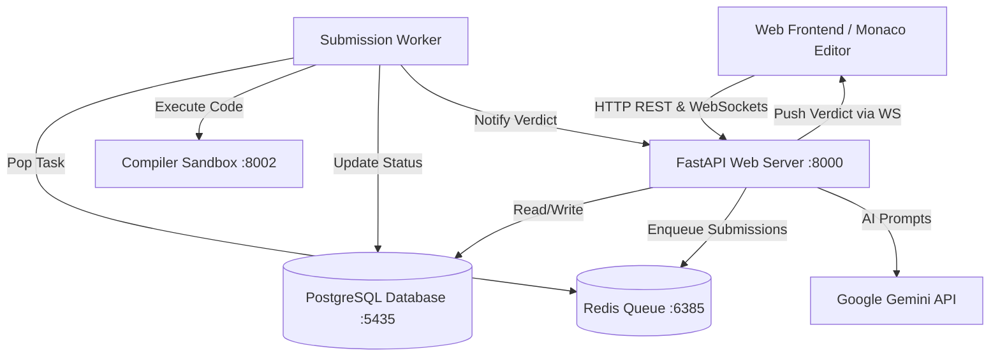

# 🚀 Submittery — An AI-Powered Online Judge & Collaborative Coding Platform

[](https://www.python.org/downloads/)
[](https://fastapi.tiangolo.com)
[](https://www.docker.com/)
[](https://opensource.org/licenses/MIT)

**Submittery** is a modern, distributed, full-stack AI Online Judge and real-time collaborative pair-programming platform. It combines asynchronous code execution in an isolated sandbox with Google Gemini AI mentorship, real-time WebSocket pair programming with live multi-cursor syncing, and an administrative problem management suite.

---

## 📸 Key Highlights & Features

### 🧠 1. Comprehensive Problem Curriculum (Blind 75 Suite)
- **47+ Curated Problems**: Covering Arrays & Hashing, Two Pointers, Sliding Window, Stack, Binary Search, Linked Lists, Trees, 1D/2D Dynamic Programming, Intervals, Matrix, and Bit Manipulation.
- **LaTeX Math Rendering & Markdown**: Formatted problem descriptions, mathematical constraints, and sample/hidden test cases.
- **Topic & Difficulty Filtering**: Quick filter by NeetCode/Blind 75 categories (*Easy, Medium, Hard*).

### ⚡ 2. Distributed Asynchronous Code Evaluation
- **Redis-Backed Task Queue**: Submissions are non-blocking and queued via Redis.
- **Background Worker**: Evaluates candidate solutions against sample and hidden test suites.
- **Sandboxed Execution Engine**: Enforces strict execution time limits and memory boundaries.
- **Real-Time Verdict Streaming**: Instant feedback via WebSockets (`Accepted`, `Wrong Answer`, `Time Limit Exceeded`, `Memory Limit Exceeded`, `Runtime Error`, `Compilation Error`).

### 👥 3. Real-Time Pair Programming & Collab Chat
- **Shareable Room Codes & Invite Links**: Instant room generation and joining.
- **Live Collaborative Monaco Editor**: Real-time code sync, multi-peer presence, and live cursor position indicators.
- **In-Session Collab Chat**: Dedicated in-room messaging drawer that activates during collaborative sessions and auto-hides when coding solo.
- **Remote Execution Broadcasts**: Live testcase run broadcasting across all connected peers in the room.

### 🤖 4. AI Mentor & Code Intelligence (Google Gemini)
- **Time & Space Complexity Analyzer**: Big-O analysis of submitted or in-editor code.
- **Intelligent Debug Hints**: Context-aware debugging suggestions without spoiling the solution.
- **Automated Code Review**: Best practice feedback on readability, performance, and clean code principles.
- **Interactive AI Assistant**: Ask questions directly within the workspace console.

### 🛡️ 5. Administrative Control Suite
- **Manage Problems Console**: Live search, difficulty filtering, and view/preview actions.
- **Problem Creation & Editing Modal**: Edit problem descriptions, starter templates, tags, time/memory limits, and dynamically add/delete test cases.
- **Global Executions Stream**: Real-time audit log of the latest submissions across all users on the platform.

---

## 🏗️ System Architecture



---

## 🛠️ Technology Stack

| Layer | Technology |
|---|---|
| **Backend API** | FastAPI (Python 3.11), SQLAlchemy, Pydantic v2, Uvicorn |
| **Frontend** | Vanilla JavaScript, TailwindCSS, Monaco Editor, KaTeX, Marked.js |
| **Database** | PostgreSQL 16 |
| **Task Queue & Caching** | Redis 7 |
| **AI Engine** | Google Gemini Generative AI SDK |
| **Compiler Service** | Subprocess Sandbox Runner (Python 3, C++, Java) |
| **Containerization** | Docker, Docker Compose |

---

## 🚀 Quickstart & Local Setup

### 1. Prerequisites
- [Git](https://git-scm.com/)
- [Python 3.11+](https://www.python.org/)
- [Docker & Docker Compose](https://www.docker.com/)

### 2. Clone the Repository
```bash
git clone https://github.com/b-harsha-v/Submittery-An-AI-online-judge.git
cd Submittery-An-AI-online-judge
```

### 3. Configure Environment Variables
Copy `.env.example` to `.env` and fill in your details:
```bash
cp .env.example .env
```
Key environment variables:
```ini
POSTGRES_USER=postgres
POSTGRES_PASSWORD=postgres
POSTGRES_DB=submittery_db
POSTGRES_HOST=localhost
POSTGRES_PORT=5435

REDIS_HOST=localhost
REDIS_PORT=6385

SECRET_KEY=your_super_secret_jwt_key
COMPILER_SERVICE_URL=http://localhost:8002
GEMINI_API_KEY=your_gemini_api_key_here
```

### 4. Start Database & Redis with Docker
```bash
docker-compose up -d
```
*This starts PostgreSQL on port `5435` and Redis on port `6385`.*

### 5. Setup Python Virtual Environment
```bash
# Create virtual environment
python -m venv venv

# Activate on Windows (PowerShell):
venv\Scripts\Activate.ps1
# Or on Linux/macOS:
source venv/bin/activate

# Install dependencies
pip install -r backend/requirements.txt
pip install -r compiler_service/requirements.txt
```

### 6. Initialize & Seed Database
```bash
python -m backend.app.init_db
```
*This automatically seeds the 47 Blind 75 problems, default test cases, and default accounts.*

---

## 💻 Running the Services Locally

To start the full stack, run the following **3 commands** in separate terminal tabs with the virtual environment activated:

```powershell
# Terminal 1: Start Main Web & WebSocket Server
uvicorn backend.app.main:app --port 8000 --reload

# Terminal 2: Start Compiler Sandbox Service
uvicorn compiler_service.main:app --port 8002 --reload

# Terminal 3: Start Asynchronous Evaluation Worker
python worker/main.py
```

Open your browser and navigate to: **`http://localhost:8000`**

---

## 🔑 Default Test Accounts

| Role | Email | Password | Access Level |
|---|---|---|---|
| **Admin** | `admin@submittery.com` | `adminpass` | Full Platform & Problem Management |
| **Standard User** | `user@submittery.com` | `userpass` | Problem Solving, Collab & Submissions |

---

## 📁 Repository Directory Layout

```
Submittery-An-AI-online-judge/
├── backend/
│   ├── app/
│   │   ├── api/             # REST endpoints (auth, problems, submissions, AI, discussions, WS)
│   │   ├── core/            # Security, rate limiters, middleware
│   │   ├── models/          # SQLAlchemy Database Models
│   │   ├── schemas/         # Pydantic Schemas & Validators
│   │   ├── services/        # AI Service, Redis Queue, WebSocket Manager
│   │   ├── static/          # Single-Page App UI (HTML, JS, CSS, Monaco Editor)
│   │   ├── database.py      # Database session and engine setup
│   │   ├── init_db.py       # Idempotent DB seeder for Blind 75 problems & users
│   │   └── main.py          # FastAPI application entrypoint
│   └── requirements.txt
├── compiler_service/
│   ├── sandbox/             # Subprocess runner, timeout & memory bounds
│   ├── main.py              # Fast execution API endpoint
│   └── requirements.txt
├── worker/
│   └── main.py              # Redis task consumer & result dispatcher
├── docker-compose.yml       # PostgreSQL and Redis services
├── .env.example             # Template environment variables
└── README.md                # Project documentation
```

---

## 📄 License
This project is open-source and licensed under the [MIT License](LICENSE).
